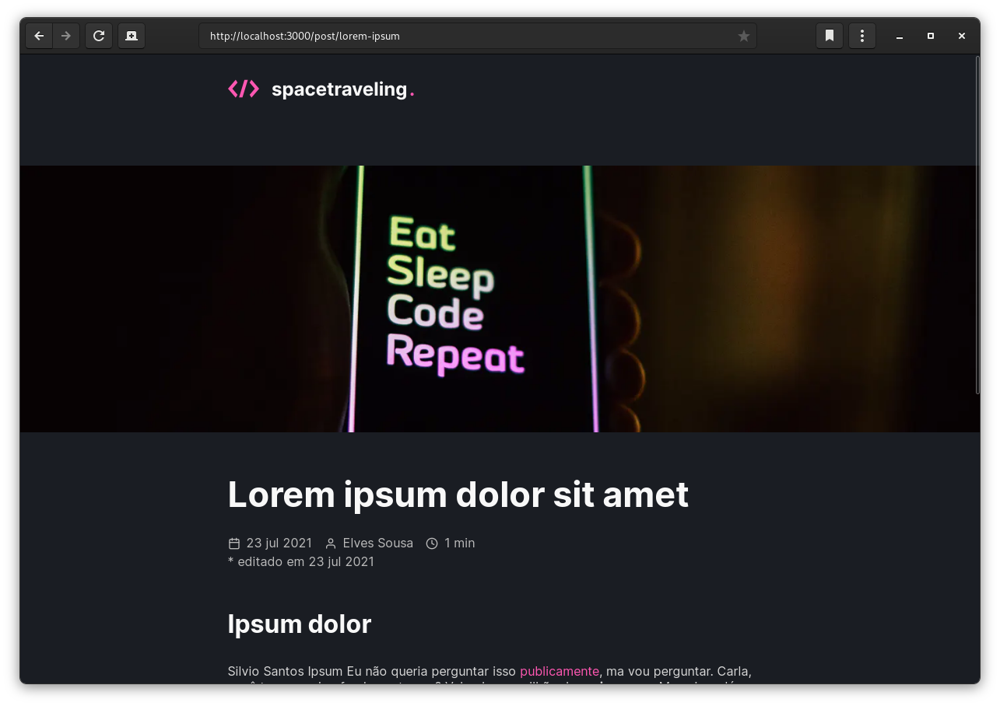
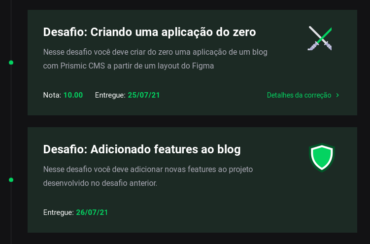

<h1 align="center">spacetraveling (ignite challenge)</h1>

#### Ignite

## Sobre o desafio

O desafio consistiu em fazer um blog do zero utilizando o [Prismic CMS](https://prismic.io) e Next.js. O blog tem suporte a pré-visualização do post antes da publicação, navegação de posts e comentários usando as Issues do repositório com [Utterances](https://utteranc.es).

---

## Testes no qual passou

- Header should be able to render logo
- Header should be able to navigate to home page after a click
- Post should be able to return prismic posts documents paths using getStaticPaths
- Post should be able to return prismic post document using getStaticProps
- Post should be able to render post document info
- Post should be able to render loading message if fallback
- Home should be able to return prismic posts documents using getStaticProps
- Home should be able to render posts documents info
- Home should be able to navigate to post page after a click
- Home should be able to load more posts if available
- Home should not be able to load more posts if not available
